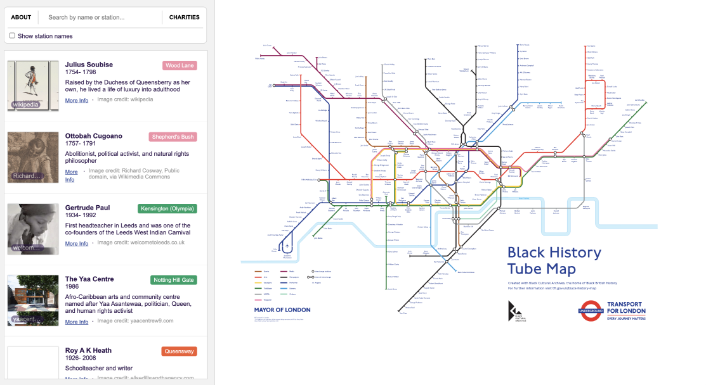

# Interactive Black History Tube Map



The **Interactive Black History Tube Map** is a single page web app purpose built for navigating the Black History Tube Map (2021).

The [Black History Tube Map](https://blackculturalarchives.org/shop/black-history-tube-map) was released by Transport of London in October 2021 to celebrate the 40th anniversary of the Black Cultural Archives. The map was researched and designed by historian Kelly Foster.

*This project is not affliated, not in collaboration nor representative of TFL, Black Cultural Archives or the original team who produced the map. This project also does not guarantee accurate representation, past or future, of the source material. Any issues should be directed to the project's github repository. All rights are reserved to their respective copyright holders.*

---

## Usage

View the site here 🌍 https://jimleuk.github.io/interactive-blackhistorytubemap

For best experience please use latest version of Chrome, Firefox or Safari.


## Features & Roadmap

- [x] Ability to pan/zoom around the map
- [x] Ability to switch between names and station names in the map
- [x] Ability to click on names/stations in the map which reveals more information in a modal.
categories
- [x] Ability to quick search by name or station
- [x] Ability to view more than one name/station at a time
- [ ] Ability to export in some form (pdf?)


## Developing

The Interactive Black History Tube Map is built using [SvelteKit](https://kit.svelte.dev) and uses supabase.com for persistence.

When developing locally, you'll need the following environment variables to connect to the supabase instance.
Create a `.env` file in the root folder and add the following
```
VITE_SUPABASE_URL=
VITE_SUPABASE_KEY=
```

## Licence

The modified tube map used for this project is a derivative of the original black history tube map provided by TFL.
Black History Tube Map &copy; Transport for London

Images, attributed or not / attributed accurately or not, are subject to copyright to their respective owners.

Source code for the Interactive Black History Tube Map site is granted under a non-commercial licence https://creativecommons.org/licenses/by-nc/4.0/

## Donation
Here are some of the charities highlighted in the map. There are for sure plenty more charities and good causes out there which should be included in this list. The plan is to add them as the project goes on.

If you have any in mind, please feel free to [submit a ticket](https://github.com/jimleuk/interactive-blackhistorytubemap/issues/new?title=Add+a+charity).

|Organisation|Station|Website|
|-|-|-|
|Black Cultural Archives|Brixton|https://blackculturalarchives.org/support|
|Black Pride UK|Kingsbury|https://www.ukblackpride.org.uk/donate|
|Exist Loudly|Queensbury|https://www.gofundme.com/f/exist-loudly-fund-to-support-queer-black-yp?utm_source=customer&utm_medium=copy_link&utm_campaign=p_cf%2Bshare-flow-1|
|Black Plaque Project|Burnt Oak|https://blackplaqueproject.com/our-mission|
|The Africa Centre|Borough|https://www.africacentre.org.uk/donate|
|Black Trans Alliance|St. John's Wood|https://www.blacktransalliance.org/Appeal/donate|
|Black Out UK|Southwark|https://blkoutuk.com/about/support-blackout-uk|
|Stop Hate UK|N/A|https://www.stophateuk.org|