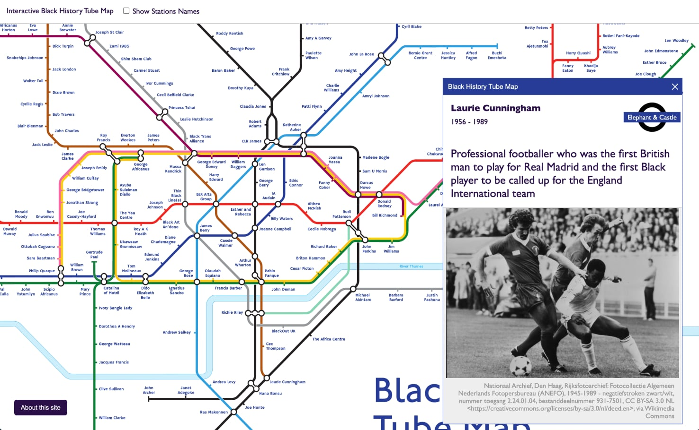

# Interactive Black History Tube Map



The **Interactive Black History Tube Map** is a single page web app purpose built for navigating the Black History Tube Map (2021).

The [Black History Tube Map](https://blackculturalarchives.org/shop/black-history-tube-map) was released by Transport of London in October 2021 to celebrate the 40th anniversary of the Black Cultural Archives. The map was researched and designed by historian Kelly Foster.

*This project is not affliated, not in collaboration nor representative of TFL, Black Cultural Archives or the original team who produced the map. This project also does not guarantee accurate representation, past or future, of the source material. Any issues should be directed to the project's github repository. All rights are reserved to their respective copyright holders.*

---

## Usage

View the site here 🌍 https://jimleuk.github.io/interactive-blackhistorytubemap

The app is only usable on browsers where [JavaScript Modules](https://developer.mozilla.org/en-US/docs/Web/JavaScript/Guide/Modules) are supported. For best experience please use latest version of Chrome, Firefox or Safari.

If viewing the app locally, please use a local http server to serve from the project's directory root. Simple open the index.html to use the app.

## Features & Roadmap

- [x] Ability to pan/zoom around the map
- [x] Ability to switch between names and station names in the map
- [x] Ability to click on names/stations in the map which reveals more information in a modal.
- [ ] Ability to filter names/stations by dates, categories
- [ ] Ability to quick search by name or station
- [ ] Ability to view more than one name/station at a time by holding shift-key
- [ ] Ability to view multiple names/stations by custom route
- [ ] Ability to navigate names/stations using keyboard
- [ ] Ability to have multiple images for names/stations
- [ ] Behaviour to focus viewport to station when name/station is selected


## Developing

The Interactive Black History Tube Map is built using plain HTML, CSS and Javascript.

There is no framework or build compilation step for this project, and instead it uses vanilla JavaScript with JavaScript Modules and vanilla CSS3. This can be a pro in that there isn't much in the way of setup or dependency dread but the drawback being a more advanced understanding of Javascript will be required.

### State management
RxJS observables are used as simple pubsub mechanisms for the various features/components of the site. There is no global store for this project.

The decision here is to avoid features/components talking to each other directly and rather decoupling them by forcing them to communicate via event messages for the most part.

An example event looks like this
```javascript
import { ofType, dispatch } from '../../actions/index.js';

// 1. Example provider sending an event to navigate to a page
dispatch({
  type: ACTIONS.NAVIGATE_TO,
  payload: { page, params }
});

...
// 2. Example of a consumer listening for specific events
// ofType is a helper method which wraps the observable. it's argment is a filter of the type of events to listen to.
ofType(ACTIONS.NAVIGATE_TO)
  // we can also have additional filtering.
  // Here we only want to receive events for the stations page
  .filter(event => event.payload.page === 'stations')
  // this is RxJS observable subscribe() method
  .subscribe(() => {
    // Do something now that we're on a stations page
  });
```
### Mobile first design
Responsive CSS is also implemented to account for mobile usage. All new features/components must have a mobile friendly view.

the current mobile viewport threshold is <=480px width. It should be noted that there are only 2 supported viewports: <=480px or desktop.

### Accessibility
Careful and deliberate effort must be made to apply the appropriate accessibility features to new components and/or content.

## Licence

The modified tube map used for this project is a derivative of the original black history tube map provided by TFL.
Black History Tube Map &copy; Transport for London

Images, attributed or not / attributed accurately or not, are subject to copyright to their respective owners.

Source code for the Interactive Black History Tube Map site is granted under a non-commercial licence https://creativecommons.org/licenses/by-nc/4.0/

## Donation
Here are some of the charities highlighted in the map. There are for sure plenty more charities and good causes out there which should be included in this list. The plan is to add them as the project goes on.

If you have any in mind, please feel free to [submit a ticket](https://github.com/jimleuk/interactive-blackhistorytubemap/issues/new?title=Add+a+charity).

|Organisation|Station|Website|
|-|-|-|
|Black Cultural Archives|Brixton|https://blackculturalarchives.org/support|
|Black Pride UK|Kingsbury|https://www.ukblackpride.org.uk/donate|
|Exist Loudly|Queensbury|https://www.gofundme.com/f/exist-loudly-fund-to-support-queer-black-yp?utm_source=customer&utm_medium=copy_link&utm_campaign=p_cf%2Bshare-flow-1|
|Black Plaque Project|Burnt Oak|https://blackplaqueproject.com/our-mission|
|The Africa Centre|Borough|https://www.africacentre.org.uk/donate|
|Black Trans Alliance|St. John's Wood|https://www.blacktransalliance.org/Appeal/donate|
|Black Out UK|Southwark|https://blkoutuk.com/about/support-blackout-uk|
|Stop Hate UK|N/A|https://www.stophateuk.org|